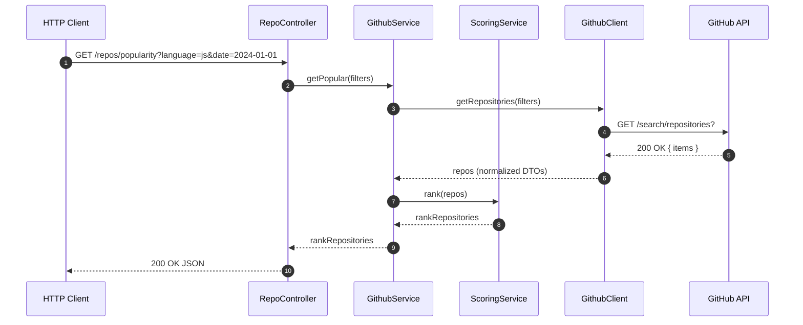

# Redcare GitHub Repository Scoring API

## Overview

This project implements a **backend service** that scores GitHub repositories based on their popularity. The application is a **REST API built with NestJS**, designed to fetch repositories from the GitHub Public API, apply a custom scoring algorithm, and return them sorted by relevance.

The service allows users to specify filtering parameters, such as **programming language** and **earliest creation date**, to refine their search results. Each repository is then evaluated and assigned a **popularity score** derived from multiple metrics.

### Task: Popularity Score Assignment

- Develop a scoring algorithm that assigns a popularity score to each repository.
- Factors contributing to the score include stars, forks, and the recency of updates.

## Architecture

The app is built around four main components, each with a specific purpose:

- **Repositories Controller** – Receives HTTP requests, validates query parameters, and passes the request to the `GithubService`.
- **Github Service** – Connects the different parts of the app. It fetches repositories from GitHub using the client and then applies the scoring logic from the `ScoringService`.
- **Scoring Service** – Handles the ranking logic. It normalizes the data and applies weighted factors to calculate a popularity score.
- **Github Client** – Manages all communication with the GitHub API. It sends HTTP requests, maps the responses into a simpler structure, and handles any API errors.

The `GithubClient` lives in its own module to keep API communication separate from the main business logic.  
This separation makes the code easier to test, maintain, and reuse.

The diagram below shows how these components interact:


## API Design

The service provides a single **GET** endpoint that takes two query parameters:  
`language` and `createdFrom`.

- `language` is **required**
- `createdFrom` is **optional**

Example:

```bash
curl -X 'GET' \
  'http://localhost:3000/repositories/popularity?language=TypeScript&createdFrom=2024-01-01' \
  -H 'accept: application/json'
```

These parameters are translated to match GitHub’s search format:

- `language=Typescript` to `q=language:Typescript`
- `createdFrom=2024-01-01` to `q=created:>=2024-01-01`.

> The `q` parameter is required for GitHub’s search endpoint to work.

### No Pagination
The GitHub API returns 30 repositories by default. Since the challenge requirements didn’t mention pagination, the service currently returns all available results in a single response. Pagination can be easily added later if needed, the structure of the service already supports extending query parameters

### No caching mechanism
GitHub repositories are dynamic and frequently updated, so this service always fetches fresh data on every request.  
To keep the implementation simple, no caching layer was added. However, caching (e.g., by query parameters) could be introduced later to reduce API calls and improve performance if needed.

### Request Flow
When the endpoint is called, the app:
	1.	Validates the query parameters.
	2.	Requests repositories from the GitHub API.
	3.	Maps the response into a simplified format.
	4.	Calculates a popularity score for each repository.
	5.	Returns the sorted list back to the client.

GitHub’s response contains a lot of data, but only a few fields are relevant for scoring.

### The simplified object used in this service looks like this:
```typescript
export interface IRepository {
  fullName: string;
  htmlUrl: string;
  description: string | null;
  language: string | null;
  stargazers: number;
  forks: number;
  updatedAt: string; // ISO string
  createdAt: string; // ISO string
  score?: number; // score assigned by the ranking algorithm
}
```

### Request Sequence Diagram



## Scoring Algorithm

The ranking algorithm is inspired by a [Reddit post](https://www.reddit.com/r/algorithms/comments/3lfxla/comment/cv6n5s1/?utm_source=share&utm_medium=web3x&utm_name=web3xcss&utm_term=1&utm_content=share_button) and was adapted to fit the challenge requirements.

Each repository is assigned a **popularity score** based on normalized metrics:

| Metric       | Weight | Description         |
| ------------ | ------ | ------------------- |
| Stars        | 0.4    | Community approval  |
| Updated date | 0.4    | Recency of activity |
| Forks        | 0.2    | Community adoption  |

### Normalization

Each metric is normalized so the sum of all normalized values = 1 using a weighted average.  
Example:

```
- Repo A stars: 100
- Repo B stars: 50
- Repo C stars: 150

Normalized: A=0.33, B=0.17, C=0.5
Final score: 0.4 * stars_norm + 0.4 * updated_norm + 0.2 * forks_norm
```

## API Documentation

### **Endpoint**

GET /repositories/popularity

### **Query Parameters**

| Name          | Type     | Required | Description                           |
| ------------- | -------- | -------- | ------------------------------------- |
| `language`    | string   | Yes      | Filter by primary language            |
| `createdFrom` | ISO date | Optional | Include repos created after this date |

> You must provide **at least one** query parameter.

### **Example Request**

```bash
curl "http://localhost:3000/repositories/popularity?language=TypeScript&createdFrom=2024-01-01"
```

### **Example Reponse**

```json
{
  "status": "OK",
  "total_count": 1234,
  "repositories": [
    {
      "fullName": "google-gemini/gemini-cli",
      "htmlUrl": "https://github.com/google-gemini/gemini-cli",
      "description": "A command-line interface for Google Gemini projects",
      "language": "TypeScript",
      "stargazers": 1500,
      "forks": 300,
      "updatedAt": "2024-05-01T12:34:56Z",
      "createdAt": "2024-04-15T08:00:00Z",
      "score": 0.95
    }
  ]
}
```

## Rate Limiting

Since we use the GitHub Public API (limited to 10 requests per minute for unauthenticated users), the service applies its own rate limiting using @nestjs/throttler to prevent exceeding that limit.

The hard limit for Github is 10 request per minuto so we decided to keep our app rate limit the same.

| Setting | Value                  |
| ------- | ---------------------- |
| ttl     | 60 seconds (60,000 ms) |
| limit   | 10 requests per minute |

The throttler limit mirrors GitHub’s public API quota (10 requests/minute) to ensure our service never exceeds it, even under load. This also prevents unnecessary 429 responses to users.

## Environment Variables

We included an example file which has a basic configuration template

```bash
cp .env.example .env
```

## Run tests

```bash
# unit tests
$ npm run test

# e2e tests
$ npm run test:e2e

# test coverage
$ npm run test:cov
```

## Compile and run the project

```bash
# development
$ npm run start

# watch mode
$ npm run start:dev

# production mode
$ npm run start:prod
```

## Swagger Docs

```bash
# Swagger UI
http://localhost:3000/api

# JSON version
http://localhost:3000/api-json
```

## Design Decisions

I chose NestJS because it provides a modular structure, built-in dependency injection, and first-class TypeScript support, which simplifies both development and testing than using Express directly.

- **NestJS Modules:** Each concern (GitHub, Scoring, Controller) is isolated for testability and scalability.
- **Dependency Injection (DI):** All dependencies (HttpService, ConfigService, ScoringService) are injected, following Inversion of Control.
- **Error Handling:** All GitHub API errors are normalized and rethrown using NestJS HttpException.
- **Rate Limiting:** @nestjs/throttler ensures fair use and protects GitHub’s public API quota.
